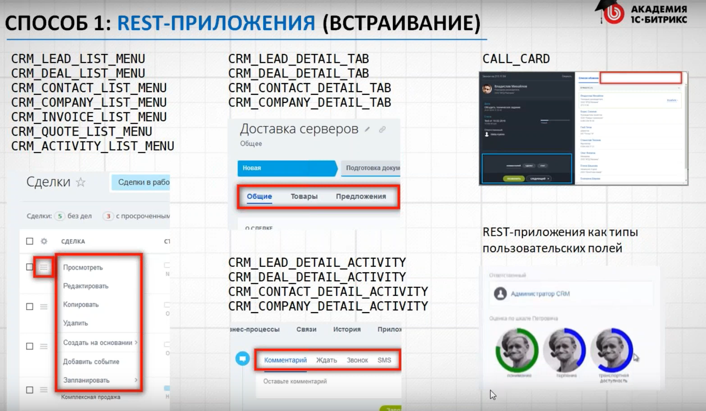
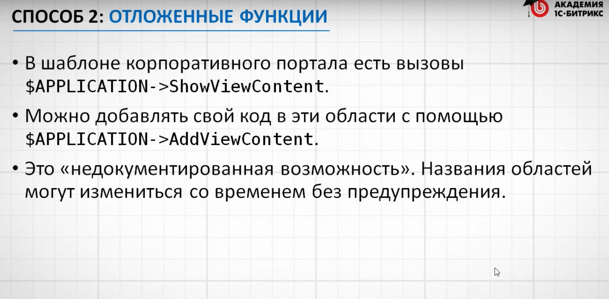
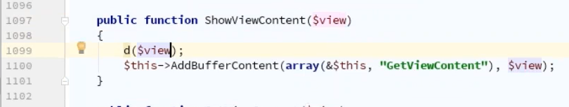
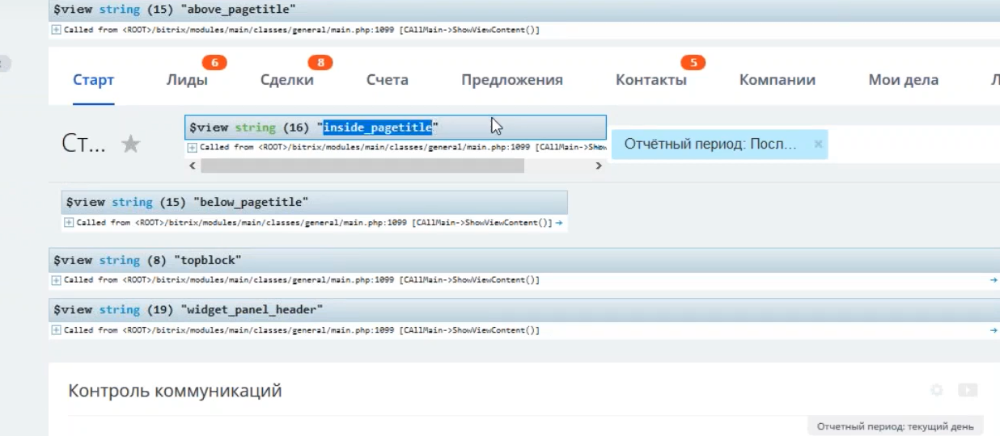

# Кастомизация интерфейса Б24
Встраиваемся в интерфейс, кастомизируем Битрикс24.

В Б24 всё является ядром: админка и публичная части, а ядро править нельзя. Копировать шаблон компонента в Б24 тоже нельзя.

Встраиваемся в интерфейс: https://youtu.be/odx3zdi1BrQ?t=545

Встраивать элементы интерфейса в Б24 можно с помощью:
- REST-приложения, (облако + коробка)
- Отложенных функций, (короба)
- Типов пользовательских полей, (облако + коробка)
- Модификации на стороне клиента (JS), (коробка)

## Встраивание REST API
Встраиваемся в интерфейс с помощью REST API

## Отложенные функции
https://dev.1c-bitrix.ru/learning/course/index.php?COURSE_ID=43&LESSON_ID=3489

https://bx24devbook.website.yandexcloud.net/Razrabotka/Tehnologii/Otlozennye_funkcii.html

Встраиваемся в интерфейс с помощью отложенных функций. Отложенные функции нужны для того чтобы сгенерировать HTML-код, раньше чем он выведется далее по коду.

- в коде шаблона Б24 ищи строки `ShowViewContent`,
- если в коде определения этой функции внедрить `d($view)` (дамп названия области),
  - функция находится по адресу: `bitrix/modules/main/classes/general/main.php`
- то в Б24 выведется информация куда можно встраиваться в интерфейс Б24 с помощью отложенных функций,

Например название области `inside_pagetitle`, встроить код в заголовок:

