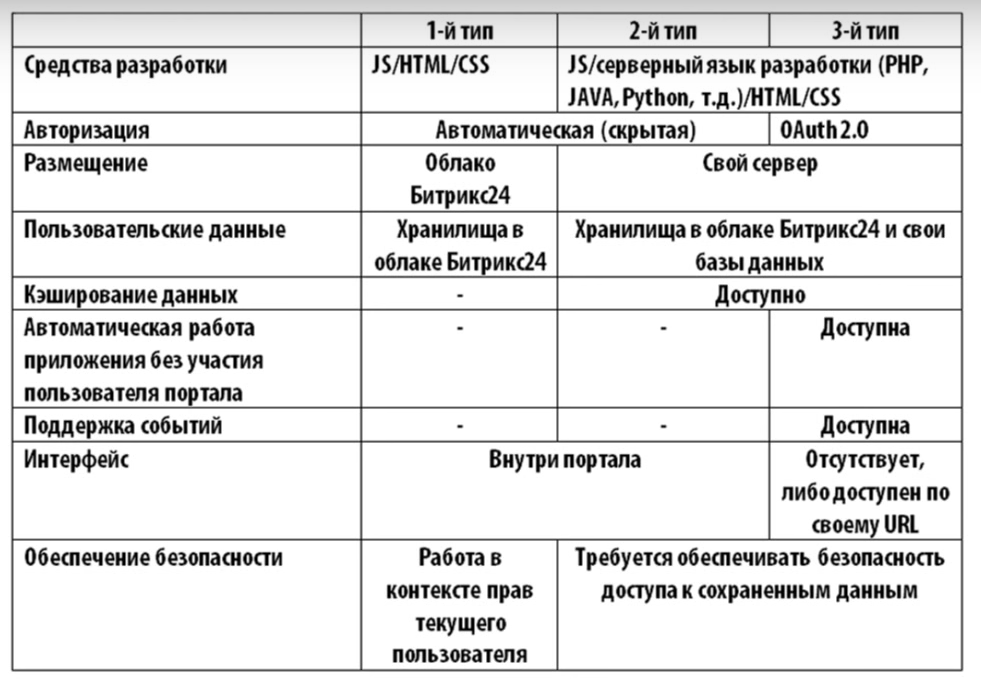

# REST
- Курс "Маркетплейс Битрикс 24": https://www.youtube.com/watch?v=qZJbKZSmtGg&list=PLzPivwyXljVV9XW3y-2-00mKZ8A-czszi&index=1
  - REST API
  - создание приложений

Обновлённый курс:
- https://dev.1c-bitrix.ru/learning/course/index.php?COURSE_ID=266

Создавать приложения можно на любом языке программирования поддерживающим RESTful API.

## REST API
REST API это набор методов доступный для приложений, для получения/изменения данных в Б24. Есть методы для CRM, работы с файлами, управления пользователями, задачами, календарями  и т.д.

REST API можно использовать для внутренней автоматизации, интеграций и кастомизации Битрикс24:
- интеграция Б24 и готового продукта
- расширение функционала Б24
- пользовательские интерфейсы

## Как работает, права на доступ к данным
Приложение взаимодействует с Б24 с помощью методов REST API. Приложение не может вмешиваться в существующий пользовательский интерфейс Б24. Если нужно показать приложение внутри Б24, то она всегда будет работать в рамках iframe.

- Приложение запрашивает авторизацию пользователя к Б24
- Б24 даёт авторизацию
- Прил запрашивает данные из CRM, и т.п.
- Б24 даёт данные в зависимости от прав пользователя
- Прил сохраняет изменённые данные

Авторизация приложения происходит под конкретным пользователем портала Б24.  
В рамках этого пользователя ограничены и права приложения.  
С помощью REST API можно оперировать любыми данными Б24.

## Типы приложений
В зависимости от того, какие задачи решает приложение, существуют различные архитектуры этих приложений.

- 1 тип (визуализация данных с помощью простых запросов): специальные отчеты по готовым данным, необычный интерфейс к стандартному функционалу
- 2 тип (хранение данных, обработка файлов): сборка статистики, интеграция с внешними сервисами, получение данных из внешних источников и сохранение их в Б24
- 3 тип (взаимодействие с Б24 без постоянного участия пользователя): автопубликация данных без участия пользователя, импорт экспорт данных без участия пользователя, периодический сбор данных, добавление заявок в CRM из форм Landing Page, реакция на события (например при изменении сделки в CRM, отправить автоматически письмо)

2,3 тип физически хранятся за пределами Б24.

## Публикация приложений
Как добавить приложение в Б24?

- Два способа публикаций.
- Структура первого и второго типа.

Для личного пользования (на однои портале):
- создать приложение
- добавить в Б24

Для публикации в каталоге (в маркетплейсе):
- получить статус технологического партнёра
- разработать приложение
- загрузить в кабинете партнера
- опубликовать в каталоге приложений

Для личного пользования:
- в Б24 жмем добавить приложение
- заполняем форму
  - особо уделяем внимание "Права доступа"
  - ссылку указываем для приложений 2,3 типа
  - ссылка на код выполняемый один раз
  - загрузка приложения, для первого типа

Структура:
- приложение может иметь любую структуру папок и файлов
- `index.html` точка входа приложения первого типа
- `install.html` файл установки приложения первого типа
- `application.php` точка входа приложения 2,3 типа
- `do_installation.php` файл установки приложения 2,3 типа

## Особенности разработки
- безопасность
- производительность
- логи и формат параметров

Безопасность:
- минимальные права (приложение должно рботать только с теми модулями которые нужны)
- валидный SSL (для приложений 2,3 типа)
- авторизация по OAuth 2.0 (для авторизаций в Б24 от имени пользователя приложения 3 типа)

Производительность:
- валидация запросов (запросы должны быть точными, а не глобальными с большой выборкой)
- обработка ошибок
- кэширование данных (прил 2,3 типа)
- пакетные запросы

Логи и формат параметров:
- логи запросов/ответов REST API:
  - мин 3 дня для хранения логов (прил 2,3 тип)
- во всех методах REST API, которые получают параметры типа дата/время, значения должны передаваться:
  - формат даты и времени ISO 8601:
  - YYYY.MM.DD hh:mm:ss

## Создание первого приложения
Пишем `hello world`.

Описание приложений 1-го типа:
- размещается в облаке Б24
- разрабатывается на JS
- не требует явной авторизации
- работает во фрейме
- может использовать внешние ресурсы (JS-библиотеки, CSS и т.п.)

Создаем первое приложение:
- создаём файл `index.html`
- добавляем туда HTML и JS-код
- архивируем в `.zip`
- переходим в `Б24/Приложения/Разработчикам/Другое/Локальное приложение`
- Вводим название приложения `Первое приложение`
- статичное
- загружаем архив
- заполняем название пункта меню `Первое приложение`
- выбираем к каким модулям у приложения будет доступ
- жмем кнопку сохранить

Код `index.html`:

    <!DOCTYPE html>
    <html lang="en">
    <head>
      <meta charset="UTF-8">
      <meta name="viewport" content="width=device-width, initial-scale=1.0">
      <title>Первое приложение Б24</title>
    </head>
    <body>
      

        

          Всем привет!

      

    </body>
    </html>

Чтобы открыть страницу с приложением или отредактировать, переходим в: `Б24/Приложения/Разработчикам/Другое/Локальное приложение`

## Разное
- Курс REST API: https://dev.1c-bitrix.ru/learning/course/index.php?COURSE_ID=266
- REST API: https://dev.1c-bitrix.ru/learning/course/?COURSE_ID=93&LESSON_ID=7885
- Документация: https://dev.1c-bitrix.ru/rest_help/
- Вебинар: https://www.youtube.com/watch?v=HshYK2Qdn0M
- Вебинары: https://development.bitrix24.site/webinars/
